# "as" vs when / while / because — Comparison Diagram

Source: [As-vs-when-while-because.md](As-vs-when-while-because.md)

---

## 1. while vs as (시간)

### while — 시간 틀(frame)만 제공, 두 절은 무관

> Expression: While I was sleeping, someone knocked.

```mermaid
%%{init: {'theme': 'dark', 'themeVariables': {'taskBkgColor': '#334155', 'activeTaskBkgColor': '#334155', 'activeTaskBorderColor': '#64748b', 'doneTaskBkgColor': '#f59e0b', 'doneTaskBorderColor': '#d97706', 'critBkgColor': '#ef4444', 'critBorderColor': '#dc2626', 'taskTextColor': '#f1f5f9', 'taskTextDarkColor': '#f1f5f9', 'sectionBkgColor': '#1e293b', 'gridColor': '#475569', 'todayLineColor': '#475569'}}}%%
gantt
    title while: sleeping은 knocked의 시간 틀일 뿐 — 둘은 무관
    dateFormat X
    axisFormat " "
    section Timeline
    I was sleeping (시간 틀)    :active, 0, 100
    someone knocked ●           :done, 100000, 10
```

**Note:** `someone knocked` is shown as a single point ● because it doesn't provide a time frame — unless specifically mentioned (e.g., "for 30 minutes").

> Expression: While you're away, I'll clean the house.

```mermaid
%%{init: {'theme': 'dark', 'themeVariables': {'taskBkgColor': '#334155', 'activeTaskBkgColor': '#334155', 'activeTaskBorderColor': '#64748b', 'doneTaskBkgColor': '#f59e0b', 'doneTaskBorderColor': '#d97706', 'critBkgColor': '#ef4444', 'critBorderColor': '#dc2626', 'taskTextColor': '#f1f5f9', 'taskTextDarkColor': '#f1f5f9', 'sectionBkgColor': '#1e293b', 'gridColor': '#475569', 'todayLineColor': '#475569'}}}%%
gantt
    title while: away는 clean의 시간 틀일 뿐 — 둘은 무관
    dateFormat X
    axisFormat " "
    section Timeline
    you're away (시간 틀)       :active, 0, 100
    I'll clean the house        :milestone, 55, 60
```

### as — 두 변화가 맞물려 함께 진행

> Expression: As the concert went on, the crowd got louder.

```mermaid
%%{init: {'theme': 'dark', 'themeVariables': {'taskBkgColor': '#1d4ed8', 'activeTaskBkgColor': '#2563eb', 'activeTaskBorderColor': '#3b82f6', 'doneTaskBkgColor': '#7c3aed', 'doneTaskBorderColor': '#8b5cf6', 'critBkgColor': '#ef4444', 'critBorderColor': '#dc2626', 'taskTextColor': '#f1f5f9', 'taskTextDarkColor': '#f1f5f9', 'sectionBkgColor': '#1e293b', 'gridColor': '#475569', 'todayLineColor': '#475569'}}}%%
gantt
    title as: 변화 A ↗ = 변화 B ↗ 함께 진행
    dateFormat X
    axisFormat " "
    section Timeline
    concert went on ↗           :active, 0, 100
    crowd got louder ↗          :done, 0, 100
```

> Expression: As you grow older, you'll understand.

### 직접 비교 — 같은 상황, 다른 단어

> Expression: While the concert went on, the crowd **was** crazy.

```mermaid
%%{init: {'theme': 'dark', 'themeVariables': {'taskBkgColor': '#334155', 'activeTaskBkgColor': '#334155', 'activeTaskBorderColor': '#64748b', 'doneTaskBkgColor': '#f59e0b', 'doneTaskBorderColor': '#d97706', 'taskTextColor': '#f1f5f9', 'taskTextDarkColor': '#f1f5f9', 'sectionBkgColor': '#1e293b', 'gridColor': '#475569', 'todayLineColor': '#475569'}}}%%
gantt
    title while: concert는 시간 틀 — crowd의 상태(was crazy)를 묘사
    dateFormat X
    axisFormat " "
    section Timeline
    the concert went on (시간 틀)   :active, 0, 100
    the crowd was crazy (상태)      :milestone, 55, 60
```

> Expression: As the concert went on, the crowd **got** crazier.

```mermaid
%%{init: {'theme': 'dark', 'themeVariables': {'taskBkgColor': '#1d4ed8', 'activeTaskBkgColor': '#2563eb', 'activeTaskBorderColor': '#3b82f6', 'doneTaskBkgColor': '#7c3aed', 'doneTaskBorderColor': '#8b5cf6', 'taskTextColor': '#f1f5f9', 'taskTextDarkColor': '#f1f5f9', 'sectionBkgColor': '#1e293b', 'gridColor': '#475569', 'todayLineColor': '#475569'}}}%%
gantt
    title as: concert 진행 = crowd 변화 — 함께 커짐
    dateFormat X
    axisFormat " "
    section Timeline
    the concert went on ↗           :active, 0, 100
    the crowd got crazier ↗         :done, 0, 100
```

**핵심 차이**:
- **while**: 시간 틀(frame)만 제공 — crowd **was** crazy (상태). 둘은 연동 안 됨
- **as**: 두 변화가 연결 — concert 진행 = crowd **got** crazier (함께 변화)

---

## 2. when vs as (시간)

### when — 시점을 콕 찍거나 선후관계

> Expression: When I arrived, everyone had already left.

```mermaid
%%{init: {'theme': 'dark', 'themeVariables': {'taskBkgColor': '#334155', 'activeTaskBkgColor': '#334155', 'activeTaskBorderColor': '#64748b', 'doneTaskBkgColor': '#065f46', 'doneTaskBorderColor': '#047857', 'critBkgColor': '#ef4444', 'critBorderColor': '#dc2626', 'taskTextColor': '#f1f5f9', 'taskTextDarkColor': '#f1f5f9', 'sectionBkgColor': '#1e293b', 'gridColor': '#475569', 'todayLineColor': '#475569'}}}%%
gantt
    title when: 특정 시점 ● 기준 선후관계
    dateFormat X
    axisFormat " "
    section Timeline
    everyone had already left   :done, 0, 25
    ● I arrived                 :milestone, 55, 60
    (이미 아무도 없음)           :milestone, 45, 50
```

> Expression: When you heat ice, it melts.

```mermaid
%%{init: {'theme': 'dark', 'themeVariables': {'taskBkgColor': '#334155', 'activeTaskBkgColor': '#10b981', 'activeTaskBorderColor': '#059669', 'doneTaskBkgColor': '#334155', 'doneTaskBorderColor': '#64748b', 'critBkgColor': '#ef4444', 'critBorderColor': '#dc2626', 'taskTextColor': '#f1f5f9', 'taskTextDarkColor': '#f1f5f9', 'sectionBkgColor': '#1e293b', 'gridColor': '#475569', 'todayLineColor': '#475569'}}}%%
gantt
    title when: 일반적 사실 — X하면 Y한다
    dateFormat X
    axisFormat " "
    section Timeline
    heat ice                    :done, 0, 50
    melts                       :crit, 3000, 60
```

### as — 두 동작이 찰나에 겹침

> Expression: As I was leaving, he arrived.

```mermaid
%%{init: {'theme': 'dark', 'themeVariables': {'taskBkgColor': '#1d4ed8', 'activeTaskBkgColor': '#2563eb', 'activeTaskBorderColor': '#3b82f6', 'doneTaskBkgColor': '#7c3aed', 'doneTaskBorderColor': '#8b5cf6', 'critBkgColor': '#ef4444', 'critBorderColor': '#dc2626', 'taskTextColor': '#f1f5f9', 'taskTextDarkColor': '#f1f5f9', 'sectionBkgColor': '#1e293b', 'gridColor': '#475569', 'todayLineColor': '#475569'}}}%%
gantt
    title as: 나가는 찰나 = 도착 (거의 동시)
    dateFormat X
    axisFormat " "
    section Timeline
    I was leaving               :active, 0, 100
    he arrived                  :done, 5000, 100
```

> Expression: She smiled as she read the letter.

**판별법**: 특정 시점/선후/일반적 사실 → **when**. 찰나 겹침/동시 진행 → **as**

---

## 3. because vs as (이유)

### because — 원인이 주인공 (직접적 화살표)

> Expression: "Why are you late?" — Because I overslept, I'm late.

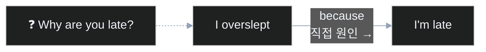

### as — 이유가 배경 (부수적, 부드러운)

> Expression: As it's raining, I'm thinking of you.

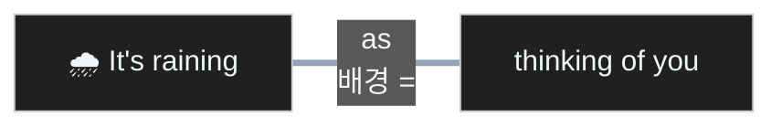

> Expression: As you're busy, let's do it later.

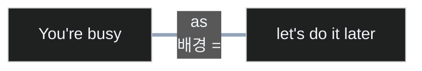

**Note:** "**Because** you're busy, let's do it later"도 문법적으로 맞다. 단어 하나 차이지만 뉘앙스가 바뀜:
- **as**: 바쁜 건 배경으로 살짝 깔아주는 느낌 — 부드러운 제안
- **because**: 바쁜 게 직접적 이유로 강조됨 — "왜 나중에?" 에 대한 명확한 답변

**판별법**: "Why?" 직접 답변 → **because**. 분위기/배경 깔기 → **as**

---

## Quick Reference

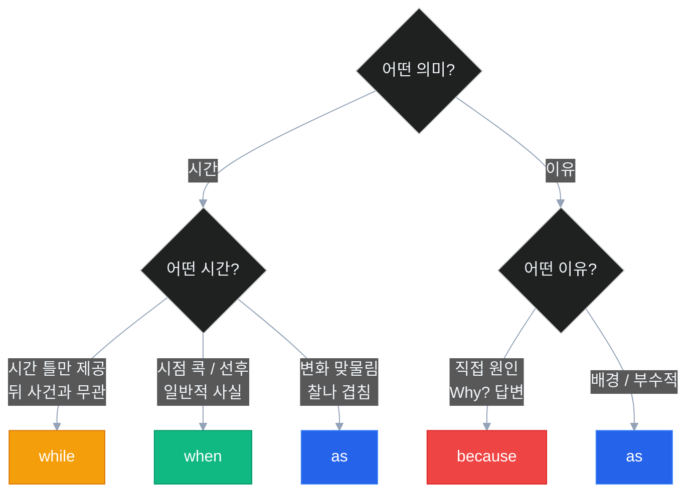
