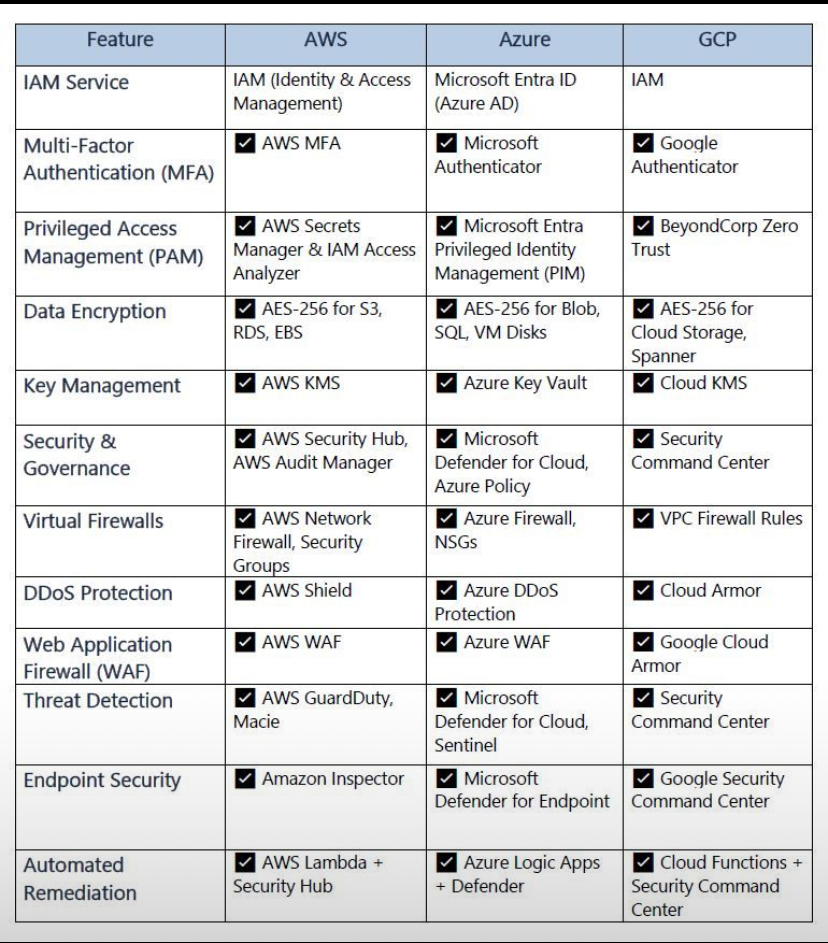
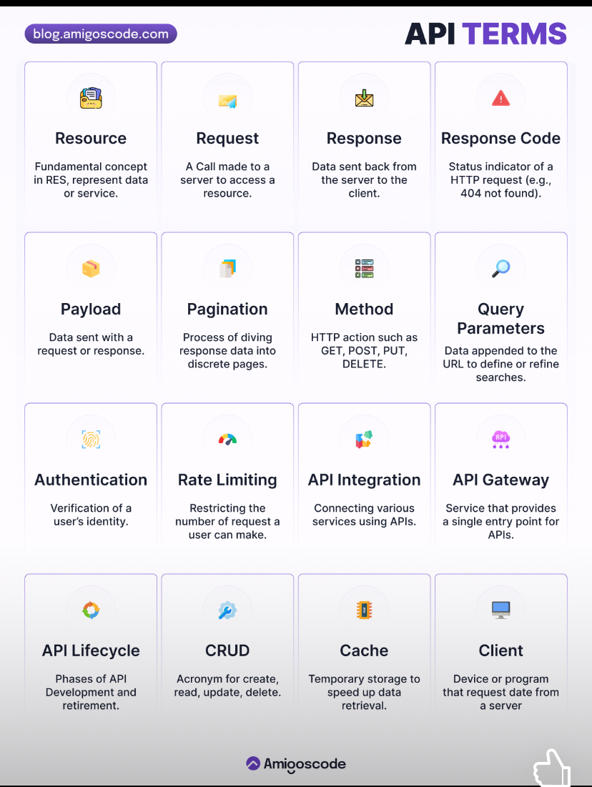

# Cloud Security Features

## Overview

A summary of core cloud security features across Access Control, Data Protection, Network Defense, and Detection/Response — with comparisons across AWS, Azure, and GCP.

---

## 1. Access Control

### IAM (Identity & Access Management)
- **Purpose**: Define who can do what, per user or service
- **When to use**: Default setup for every cloud environment
- **Key concepts**: Role, Policy, Least Privilege principle

### MFA (Multi-Factor Authentication)
- **Purpose**: Require additional authentication beyond passwords
- **When to use**: At login — especially for admin accounts and sensitive operations
- **Key concepts**: Something you know (password) + Something you have (app/token)

### PAM (Privileged Access Management)
- **Purpose**: Separately control high-privilege accounts like admin/root
- **When to use**: Production access, direct DB access, and other high-risk operations
- **Key concepts**: Just-in-Time access (temporary privileges granted only when needed), session recording

---

## 2. Data Protection

### Data Encryption
- **Purpose**: Make data unreadable via encryption
- **When to use**: Both at rest and in transit
- **Key concepts**: AES-256 (symmetric encryption), TLS (transit encryption), targets include storage/DB/disk

### KMS (Key Management Service)
- **Purpose**: Securely manage the encryption keys themselves
- **When to use**: When creating, rotating, or revoking encryption keys
- **Key concepts**: Paired with Encryption — if keys leak, encryption is meaningless. Auto-rotation policies are critical

---

## 3. Network Defense

### Virtual Firewall
- **Purpose**: Control allowed/blocked traffic at the network level
- **When to use**: Setting communication rules between VMs or subnets
- **Key concepts**: Inbound/Outbound rules, Security Group (instance-level), NSG (subnet-level)

### WAF (Web Application Firewall)
- **Purpose**: Block attacks targeting web apps (SQL Injection, XSS, etc.)
- **When to use**: Placed in front of externally exposed web services
- **Key concepts**: Regular Firewall = IP/port-based; WAF = analyzes HTTP request content. Layer 7 defense

### DDoS Protection
- **Purpose**: Defend against attacks that flood services with fake traffic
- **When to use**: Always, when running public-facing services
- **Key concepts**: Traffic pattern analysis, automatic abnormal traffic filtering. Different defense target than Firewall/WAF

---

## 4. Detection & Response

### Security & Governance
- **Purpose**: Monitor whether security policies are being followed
- **When to use**: Compliance audits, configuration error detection (e.g., is an S3 bucket accidentally public?)
- **Key concepts**: Automatic policy violation detection, compliance reporting

### Threat Detection
- **Purpose**: Detect suspicious activity in real time
- **When to use**: Abnormal login attempts, unusual traffic patterns, malicious IP access
- **Key concepts**: Log analysis, ML-based anomaly detection. If Security & Governance = "rule compliance", this = "threat detection"

### Endpoint Security
- **Purpose**: Inspect vulnerabilities on individual servers/VMs
- **When to use**: Checking for missing OS patches, known CVE vulnerabilities
- **Key concepts**: Vulnerability scanning, patch recommendations, per-server security checks

### Automated Remediation
- **Purpose**: Auto-fix detected security issues without human intervention
- **When to use**: Repetitive, clear-cut security violations (e.g., auto-close publicly open ports)
- **Key concepts**: Detect → Trigger → Auto-action. Implemented via serverless (Lambda/Logic Apps)

---

## References

- 
