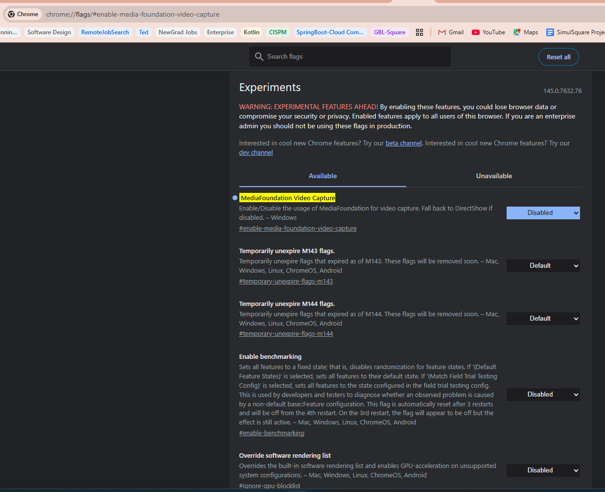

# MediaFoundation Video Capture (Windows)

## Problem
After switching laptops (ASUS → Acer), Chrome camera stopped working properly.

## Solution
Disable `MediaFoundation Video Capture` flag in Chrome:
- `chrome://flags/#enable-media-foundation-video-capture` → **Disabled**
- Falls back to DirectShow (legacy but more compatible)

## Context
- **MediaFoundation**: Modern Windows media API (successor to DirectShow)
- **DirectShow**: Legacy Windows media API, broader hardware compatibility
- Chrome uses MediaFoundation by default, but some hardware/driver combinations cause issues
- Origin: [laptop-migration task](../../../../Archive/Tasks/laptop-migration/laptop-migration.md)

