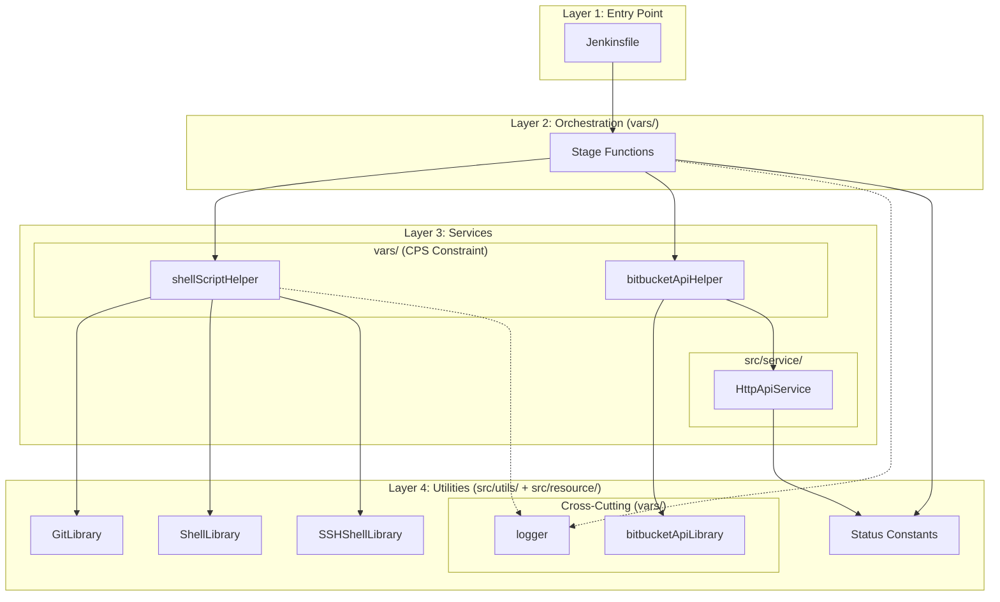
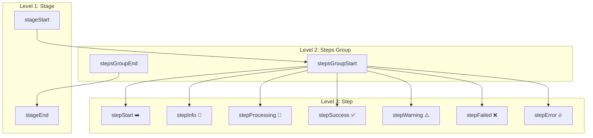
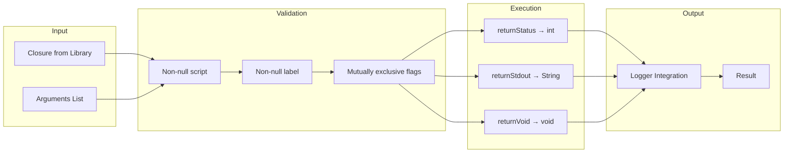
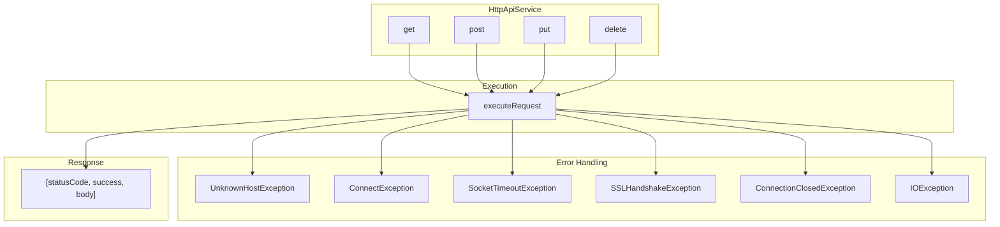
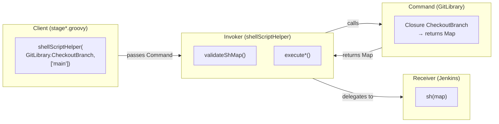
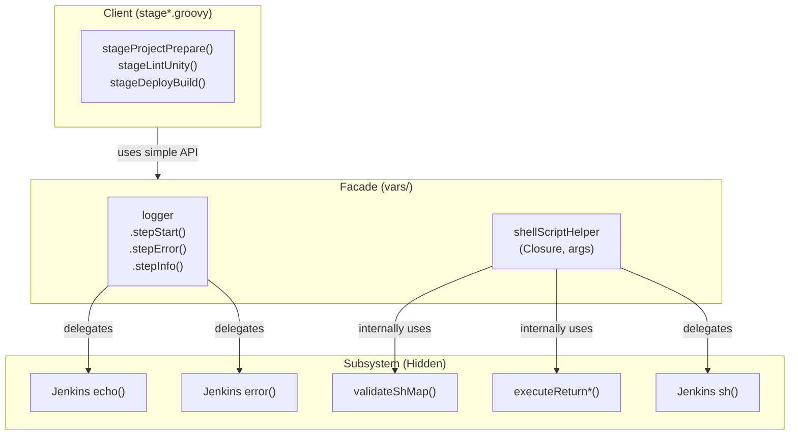
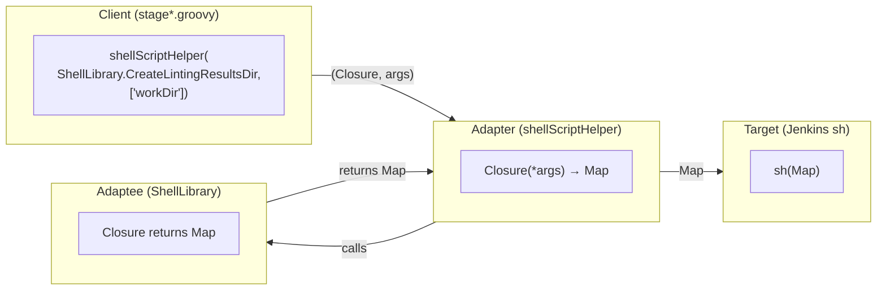

# Solution by Layer

> Layer-by-layer architecture analysis of the refactored codebase.
>
> For feature-by-feature breakdown, see [solution-by-feature.md](solution-by-feature.md).
> For high-level overview, see [README.md](README.md).

---

## Reference Commit

| State | Commit Hash | Date |
|-------|-------------|------|
| **Final** | [`ff74ac8`](https://github.com/JindoKimKor/devops-jenkins-linux/tree/ff74ac8) | 2025-05-12 |

---

## Table of Contents

- [Overview](#1-overview)
- [Complete File Structure](#2-complete-file-structure)
- [Folder-by-Folder Analysis](#3-folder-by-folder-analysis)
- [Design Patterns Applied](#4-design-patterns-applied)
- [Current State Summary](#5-current-state-summary)
- [Reference](#6-reference)

---

## 1. Overview

### 1.1 File Statistics

| Category | Files | Lines (approx) | Status |
|----------|-------|----------------|--------|
| **sharedLibraries/vars/** | 13 | 1,104 | NEW - Pipeline stages |
| **sharedLibraries/src/** | 5 | 1,047 | NEW - Core business logic |
| **groovy/** | 3 | 1,824 | Legacy (being migrated) |
| **DLXJenkins/** | 2 | 286 | Refactored |
| **JsJenkins/** | 2 | 743 | Being Refactored |
| **PipelineForJenkins/** | 1 | 185 | Being Refactored |
| **python/** | 15 | 2,069 | Legacy (to be eliminated) |
| **Bash/** | 2 | 330 | Shell scripts |
| **tests/** | 5 | 200 | NEW - Unit tests |
| **TOTAL** | 48 | 7,788 | |

### 1.2 Architecture Summary

The refactored codebase implements a **4-Layer Architecture** with clear separation of concerns:



---

## 2. Complete File Structure

```
devops-linux-jenkins/
│
├── sharedLibraries/                                    [18 files - Core Library]
│   ├── vars/                                           [13 files - Pipeline Functions]
│   │   ├── logger.groovy                                   - Centralized logging
│   │   ├── shellScriptHelper.groovy                        - Shell execution wrapper
│   │   ├── bitbucketApiHelper.groovy                       - Bitbucket API facade
│   │   ├── bitbucketApiLibrary.groovy                      - API request builder
│   │   ├── stageInitialization.groovy                      - Pipeline initialization
│   │   ├── stageProjectPrepare.groovy                      - Project preparation
│   │   ├── stageLintUnity.groovy                           - Unity linting
│   │   ├── stageLintGroovyJenkinsfile.groovy               - Groovy linting
│   │   ├── stageUnityExecution.groovy                      - Unity test execution
│   │   ├── stageStaticAnalysis.groovy                      - SonarQube analysis
│   │   ├── stageSendBuildResults.groovy                    - Build result reporting
│   │   ├── stageDeployBuild.groovy                         - Build deployment
│   │   └── stageCleanupPRBranchArtifacts.groovy            - PR cleanup
│   │
│   └── src/                                            [5 files - Library Source]
│       ├── resource/
│       │   └── Status.groovy                               - Status constants
│       │
│       ├── service/general/
│       │   └── HttpApiService.groovy                       - HTTP client
│       │
│       └── utils/
│           ├── GitLibrary.groovy                           - Git operations (23 closures)
│           ├── ShellLibrary.groovy                         - Shell operations (15 closures)
│           └── SSHShellLibrary.groovy                      - SSH operations (8 closures)
│
├── DLXJenkins/                                         [2 files - Unity Pipeline]
│   ├── Jenkinsfile
│   └── JenkinsfileDeployment
│
├── JsJenkins/                                          [2 files - JavaScript Pipeline]
│   ├── Jenkinsfile
│   └── JenkinsfileDeployment
│
├── PipelineForJenkins/                                 [1 file - Self Pipeline]
│   └── Jenkinsfile
│
├── groovy/                                             [3 files - Legacy Helpers]
│   ├── generalHelper.groovy                                - Being migrated
│   ├── jsHelper.groovy                                     - Being migrated
│   └── unityHelper.groovy                                  - Being migrated
│
├── python/                                             [15 files - Legacy Scripts]
│   └── (to be eliminated)
│
└── tests/                                              [5 files - Unit Tests]
    ├── GeneralHelperSpec.groovy
    └── src/
        ├── resource/
        │   ├── JenkinsFile.groovy                          - Mock interface
        │   └── StatusSpec.groovy
        └── utils/
            └── GitLibrarySpec.groovy                       - Git closure tests
```

---

## 3. Folder-by-Folder Analysis

### 3.1 sharedLibraries/vars/ - Pipeline Stage Functions

The `vars/` directory in Jenkins Global Shared Library defines global functions callable directly from pipelines.

| File | Lines | Purpose |
|------|-------|---------|
| `stageInitialization.groovy` | 103 | Environment setup, send INPROGRESS status |
| `stageProjectPrepare.groovy` | 186 | Git workspace preparation, branch sync |
| `stageLintUnity.groovy` | 67 | Unity C# linting |
| `stageLintGroovyJenkinsfile.groovy` | 96 | Groovy/Jenkinsfile linting |
| `stageUnityExecution.groovy` | 99 | Unity test execution (EditMode/PlayMode/Coverage/WebGL) |
| `stageStaticAnalysis.groovy` | 87 | SonarQube analysis |
| `stageSendBuildResults.groovy` | 39 | Build result publishing |
| `stageDeployBuild.groovy` | 72 | SSH deployment |
| `stageCleanupPRBranchArtifacts.groovy` | 62 | PR artifact cleanup |

#### logger.groovy - 3-Level Hierarchical Logging



#### shellScriptHelper.groovy - Validated Shell Execution



---

### 3.2 sharedLibraries/src/ - Core Business Logic

> **\* CPS Constraint Note**: `logger.groovy`, `shellScriptHelper.groovy`, `bitbucketApiHelper.groovy`, `bitbucketApiLibrary.groovy` are located in `vars/` instead of `src/` due to Jenkins CPS (Continuation Passing Style) serialization constraints. These files use Jenkins DSL methods (`echo`, `sh`, `withCredentials`) that require CPS-compatible execution context.

#### 3.2.1 vars/ Helpers (CPS-constrained)*

| File | Lines | Purpose | Design Pattern |
|------|-------|---------|----------------|
| `logger.groovy` | 83 | 3-level hierarchical logging | Facade |
| `shellScriptHelper.groovy` | 105 | Validated shell execution | Command/Adapter |
| `bitbucketApiHelper.groovy` | 36 | Bitbucket API facade | Facade |
| `bitbucketApiLibrary.groovy` | 69 | API request builder | Builder |

#### logger.groovy - 3-Level Hierarchical Logging

#### 3.2.2 src/utils/ - Command Libraries

##### GitLibrary.groovy (23 Closures)

| Category | Closures |
|----------|----------|
| **Fetch** | FetchOrigin, FetchBranch |
| **Branch** | ShowCurrentBranch, CheckoutBranch, GetOriginDefaultBranch, CheckOriginBranchExists, CheckBranchExists |
| **Status** | CheckUpToDateWithRemote, CheckIsRemoteBranchAncestor |
| **Reset/Clean** | ResetHardHead, CleanUntracked, RemoveIndexLock |
| **Clone/Pull** | CloneRepository, Pull, ResetHardOriginBranch |
| **Merge** | MergeOriginBranch |
| **LFS** | LfsListUntrackedFiles, LfsFetchAndCheckout |
| **Hash** | GetRemoteBranchHash |

##### ShellLibrary.groovy (15 Closures)

| Category | Closures |
|----------|----------|
| **Environment** | PrintJenkinsEnv |
| **Directory** | FindPRJobDirectory, FindProjectDirectory, CreateLintingResultsDir |
| **Docker** | DockerInfo, GroovyLint |
| **Unity** | GetUnityExecutable, LintUnity, CopyWebGLBuilder, CopyLintConfig |
| **Reporting** | ExecutePythonStatusReport, CreateBitbucketBuildReport, CreateBitbucketTestReport |

##### SSHShellLibrary.groovy (8 Closures)

| Closure | Purpose |
|---------|---------|
| CheckSSHConnectivity | Test SSH connection |
| CreateDirectoryAndSetPermission | Create remote directory |
| CopyBuildToHostServer | SCP build artifacts |
| UpdateBuildURL | Execute remote script |
| CleanMergedPRBranchFromHostServer | Remove PR artifacts |
| CreateDirectoryAndSetPermissionForEconestogaDlxServer | Econestoga server setup |
| CopyBuildToEconestogaDlxServer | Econestoga deployment |
| UpdateBuildURLForEconestogaDlxServer | Econestoga URL update |

#### 3.2.3 src/service/ - Business Logic Services

##### HttpApiService.groovy (172 lines)



#### 3.2.4 src/resource/ - Constants

##### Status.groovy

```groovy
class Status {
    static final Map<String, String> STAGE_STATUS = [
        'SUCCESS', 'UNSTABLE', 'FAILURE', 'ABORTED', 'SKIPPED'
    ]
    static final Map<String, String> BUILD_STATUS = [
        'SUCCESS', 'UNSTABLE', 'FAILURE', 'ABORTED', 'NOT_BUILT'
    ]
    static final Map<String, String> COMMIT_STATUS = [
        'SUCCESSFUL', 'INPROGRESS', 'FAILED', 'STOPPED'
    ]
}
```

---

### 3.3 DLXJenkins/ - Pipeline Definitions (Refactored)

```groovy
@Library('global-trusted-shared-library@main') _

import resource.Status
import utils.GitLibrary

pipeline {
    stages {
        stage('Jenkins Initialization') { steps { stageInitialization() } }
        stage('Project Preparation') { steps { stageProjectPrepare() } }
        stage('Linting') { steps { stageLintUnity() } }
        stage('EditMode Tests') { steps { stageUnityExecution('EditMode') } }
        stage('PlayMode Tests') { steps { stageUnityExecution('PlayMode') } }
        stage('Build Project') { steps { stageUnityExecution('Webgl') } }
        stage('Send Build Results') { steps { stageSendBuildResults() } }
    }
    post {
        always {
            script {
                dir(env.PROJECT_DIR) {
                    shellScriptHelper(GitLibrary.ShowCurrentBranch)
                    shellScriptHelper(GitLibrary.ResetHardHead)
                    shellScriptHelper(GitLibrary.CleanUntracked)
                    shellScriptHelper(GitLibrary.CheckoutBranch, [env.DESTINATION_BRANCH])
                }
            }
        }
        success { bitbucketApiHelper(bitbucketApiLibrary.createBuildStatusForCommit(...)) }
        failure { bitbucketApiHelper(bitbucketApiLibrary.createBuildStatusForCommit(...)) }
    }
}
```

**Characteristics:**
- No business logic (all delegated to vars/ functions)
- Declarative pipeline structure
- Consistent pattern: `steps { stageFunctionName() }`

---

## 4. Design Patterns Applied

> **Source:** Gang of Four (GoF) - "Design Patterns: Elements of Reusable Object-Oriented Software" (1994) by Erich Gamma, Richard Helm, Ralph Johnson, and John Vlissides

### 4.1 Command Pattern (Behavioral)

<!--
**GoF Command Pattern 구성요소:**
- **Command**: 실행할 작업을 캡슐화한 객체
- **Invoker**: Command를 실행하는 주체
- **Receiver**: 실제 작업을 수행하는 객체
- **Client**: Command를 생성하고 Invoker에 전달

**우리 코드에서:**

```groovy
// Client (stage*.groovy)
shellScriptHelper(GitLibrary.CheckoutBranch, ['main'])

// Command (GitLibrary.groovy) - 작업을 Map으로 캡슐화
static final Closure CheckoutBranch = { String branchName ->
    [
        script: "git checkout ${branchName}",
        label: "Checkout branch '${branchName}'",
        returnStdout: true
    ]
}

// Invoker (shellScriptHelper.groovy) - Command 실행
def call(Closure shellScriptClosure, List args = []) {
    Map shMap = shellScriptClosure(*args)  // Command 실행 → Map 반환
    // ... validation ...
    sh(shMap)  // Receiver에 전달
}

// Receiver (Jenkins sh() step) - 실제 작업 수행
```

**왜 Command Pattern인가:**
1. **캡슐화**: `git checkout` 명령이 Closure(객체)로 캡슐화됨
2. **파라미터화**: `branchName` 파라미터로 다양한 변형 가능
3. **분리**: 명령 정의(GitLibrary)와 실행(shellScriptHelper)이 분리됨
4. **재사용**: 같은 Command를 여러 곳에서 재사용
-->

**Definition:** Encapsulates a request as an object, allowing parameterization and queuing of requests.

**Where:** GitLibrary, ShellLibrary, SSHShellLibrary

**Why it applies:** Each Closure encapsulates a shell command as an object (Map with script, label, returnType). The `shellScriptHelper` (Invoker) executes these commands without knowing their implementation details.



### 4.2 Facade Pattern (Structural)

<!--
**GoF Facade Pattern 구성요소:**
- **Client**: Facade를 사용하는 코드 (Subsystem을 직접 접근하지 않음)
- **Facade**: 단순화된 인터페이스를 제공하는 클래스 (Subsystem으로 요청 위임)
- **Subsystem**: 복잡한 내부 시스템 (여러 클래스/컴포넌트, Facade 존재를 모름)

**우리 코드에서:**

```groovy
// Client (stage*.groovy)
logger.stepStart("Starting process")
shellScriptHelper(GitLibrary.CheckoutBranch, ['main'])

// Facade (logger.groovy) - Jenkins echo() + 포맷팅/이모지/레벨 구분 숨김
void stepStart(String description) {
    echo "➡️ Step Starting: \n[ ${description} ]..."
}
void stepError(String description, Throwable err) {
    // Stack trace 처리, 포맷팅 등 복잡한 로직 숨김
    error("🔥 Step Error: ...")
}

// Facade (shellScriptHelper.groovy) - validation + execution routing + logging 숨김
def call(Closure shellScriptClosure, List args = []) {
    Map shMap = shellScriptClosure(*args)
    Map validatedShMap = validateShMap(shMap)  // validation 숨김
    // execution routing (returnStatus/returnStdout/void) 숨김
    sh(shMap)  // Subsystem 호출
}

// Subsystem (Jenkins DSL) - echo, sh, error
```

**왜 Facade Pattern인가:**
1. **단순화**: Client는 `logger.stepStart()` 한 줄로 로깅 (echo 포맷 몰라도 됨)
2. **캡슐화**: Jenkins DSL 복잡성 + validation + routing이 Facade 뒤에 숨겨짐
3. **분리**: Subsystem 변경해도 Client 코드 영향 없음
4. **일관성**: 모든 로깅이 동일한 포맷으로 출력됨
-->

**Definition:** Provides a simplified interface to a complex subsystem, reducing dependencies between clients and the subsystems they interact with.

**Where:** logger, shellScriptHelper

**Why it applies:** These helpers hide the complexity of Jenkins DSL (`echo`, `sh`, `error`) and internal logic (validation, routing, formatting) behind simple function calls.



### 4.3 Adapter Pattern (Structural)

<!--
**GoF Adapter Pattern 구성요소:**
- **Client**: Target 인터페이스를 사용하는 코드
- **Target**: Client가 기대하는 인터페이스
- **Adapter**: Target 인터페이스를 구현하고, Adaptee를 변환
- **Adaptee**: 기존에 존재하는 호환되지 않는 인터페이스

**우리 코드에서:**

```groovy
// Client (stage*.groovy) - (Closure, args) 형태로 호출
shellScriptHelper(ShellLibrary.CreateLintingResultsDir, ["${env.REPORT_DIR}"])

// Adaptee (ShellLibrary Closure) - Closure + args 형태
static final Closure CreateLintingResultsDir = { String workingDir ->
    [script: "mkdir -p '${workingDir}/linting_results'", label: "...", returnStatus: true]
}

// Target (Jenkins sh() step) - Map 형태를 기대
sh([script: "...", label: "...", returnStatus: true])

// Adapter (shellScriptHelper) - (Closure, args) → Map 변환
def call(Closure shellScriptClosure, List args = []) {
    Map shMap = shellScriptClosure(*args)  // Adaptee 호출 → Map 반환
    Map validatedShMap = validateShMap(shMap)
    sh(validatedShMap)  // Target 호출
}
```

**왜 Adapter Pattern인가:**
1. **인터페이스 변환**: Client는 (Closure, args), sh()는 Map 기대
2. **호환성**: Client가 sh(Map) 직접 호출 안 해도 됨
3. **분리**: Closure 정의와 실행이 분리됨

**Note:** shellScriptHelper는 Adapter이면서 동시에 Facade
- Adapter: (Closure, args) → Map 형식 변환
- Facade: validation, routing, logging 복잡성 숨김
-->

**Definition:** Converts the interface of a class into another interface clients expect, allowing incompatible interfaces to work together.

**Where:** shellScriptHelper

**Why it applies:** Converts `(Closure, args)` interface that Client uses into `Map` interface that Jenkins `sh()` expects.



> **Note:** `shellScriptHelper` is both Adapter and Facade. Adapter for interface conversion, Facade for hiding internal complexity (validation, routing, logging).

---

## 5. Current State Summary

| Principle | Implementation |
|-----------|----------------|
| **Separation of Concerns** | vars/: orchestration, service/: business logic, utils/: commands, resource/: constants |
| **Reusability** | 46 shell commands available to all stages, single logger instance |
| **Maintainability** | Change logging → edit logger.groovy only, Add Git op → add 1 closure |
| **Testability** | Mock-friendly constructors, Spock framework integration |

---

## 6. Reference

### Repository

- **GitHub**: `https://github.com/JindoKimKor/devops-jenkins-linux`

### Related Documents

- [solution-by-feature.md](solution-by-feature.md) - Feature-by-feature breakdown
- [logger-system-design-integration.md](logger-system-design-integration.md) - Logger System design
- [domain-driven-analysis.md](domain-driven-analysis.md) - DDD pattern analysis