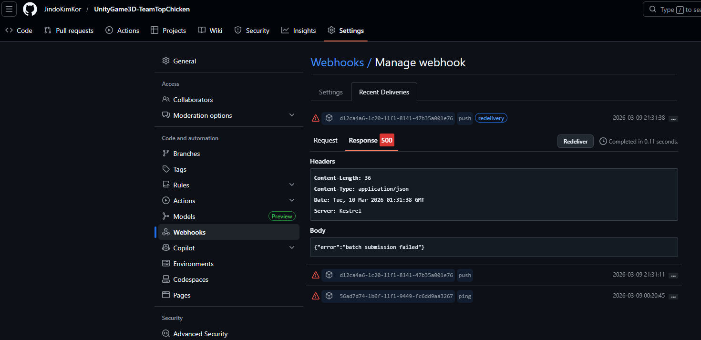
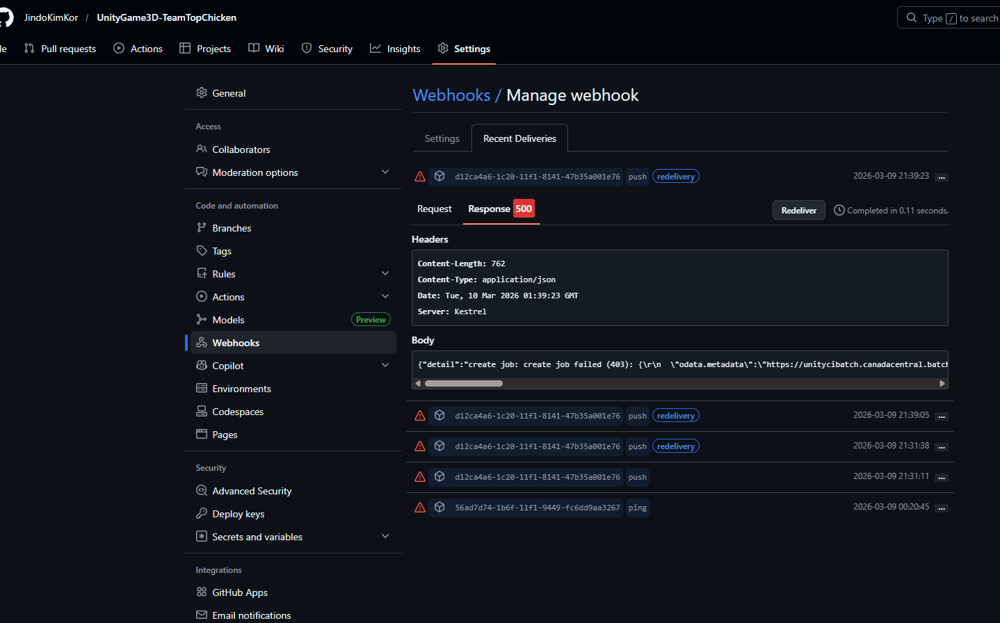
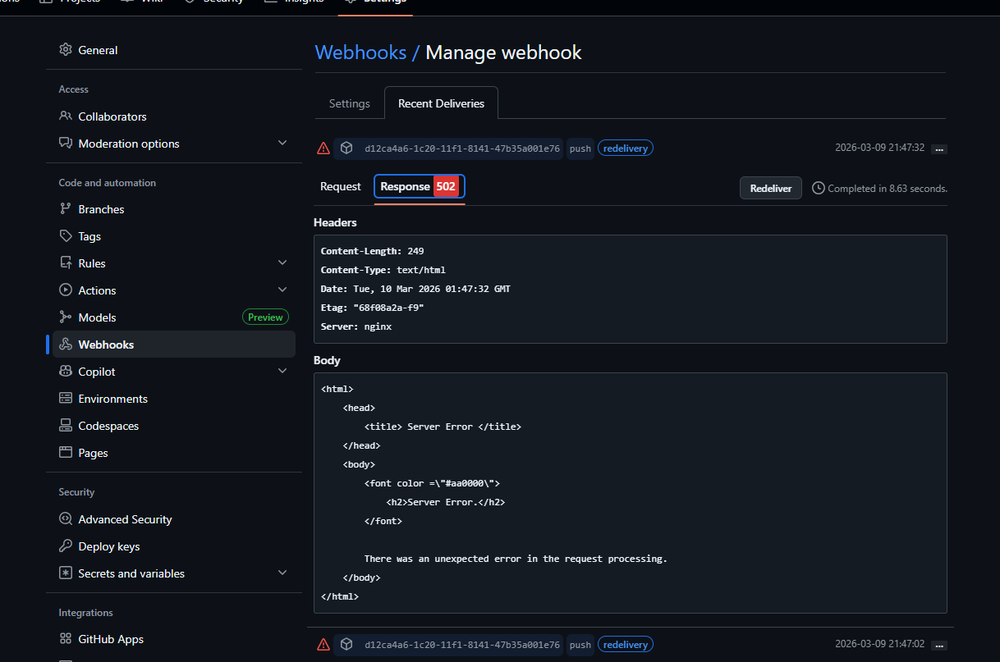
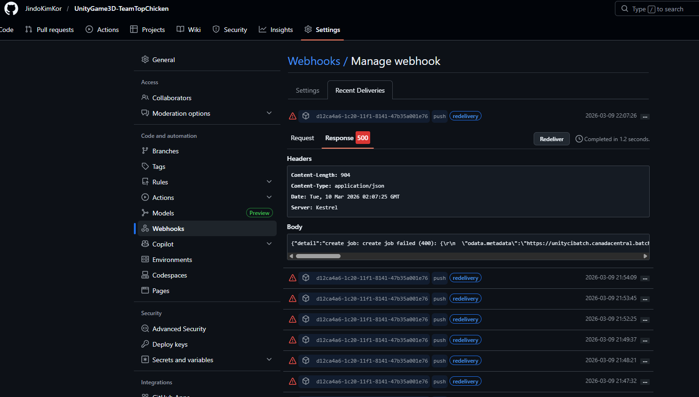
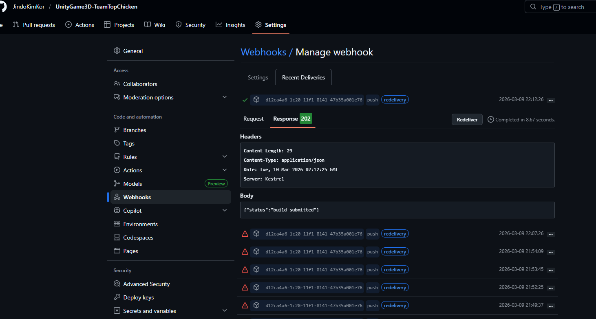
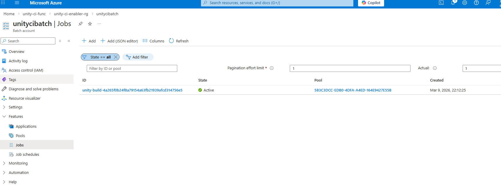

## Log (Monitoring)

### What did I actually do?

#### Phase 1: Manual CLI Deployment (Previous Session → This Session)

이전 세션에서 Azure Function App 배포 중 404 → 500 → 503 → timeout 문제가 연속 발생.
원인을 찾지 못해 **전부 삭제하고 처음부터 CLI로 하나하나 재시작**하기로 결정.

##### Step 1: Function App 재생성 (CLI) → [step1-create-func.log](resources/step1-create-func.log)

```
az functionapp create --name unity-ci-func \
  --resource-group unity-ci-enabler-rg \
  --storage-account unitycifuncstorage \
  --consumption-plan-location canadacentral \
  --runtime custom --functions-version 4 --os-type Linux
```

- `--runtime custom`을 지정하면 Azure가 자동으로 `FUNCTIONS_WORKER_RUNTIME=custom` 설정
- Application Insights (`unity-ci-func`)와 Action Group (`Application Insights Smart Detection`)이 자동 생성됨
- App Service Plan `CanadaCentralLinuxDynamicPlan`도 자동 생성 (Terraform의 `unity-ci-func-plan`과는 별개)

##### Step 2: Managed Identity 할당 → [step2-identity.log](resources/step2-identity.log)

```
az functionapp identity assign --name unity-ci-func --resource-group unity-ci-enabler-rg
```

- SystemAssigned Managed Identity 활성화
- principalId: `86682b03-27c2-4001-abef-5e4fe3b05c84` 발급됨
- 이 identity가 Key Vault와 Batch API에 접근할 때 사용됨

##### Step 2b: Key Vault Access Policy 설정 → [step2b-keyvault.log](resources/step2b-keyvault.log)

```
az keyvault set-policy --name unity-ci-kv \
  --object-id 86682b03-27c2-4001-abef-5e4fe3b05c84 \
  --secret-permissions get
```

- Function App의 Managed Identity에 Key Vault secret `Get` 권한 부여
- Go 바이너리가 시작할 때 `WEBHOOK-SECRET`을 Key Vault에서 읽어옴

##### Step 3a: App Settings 설정 → [step3a-settings.log](resources/step3a-settings.log)

```
az functionapp config appsettings set --name unity-ci-func \
  --resource-group unity-ci-enabler-rg \
  --settings KEY_VAULT_NAME=unity-ci-kv \
             BATCH_ACCOUNT_URL=https://unitycibatch.canadacentral.batch.azure.com
```

##### Step 3b: IMAGE_RESOURCE_ID 설정 → [step3b-image-resource-id.log](resources/step3b-image-resource-id.log)

```
MSYS_NO_PATHCONV=1 az functionapp config appsettings set --name unity-ci-func \
  --resource-group unity-ci-enabler-rg \
  --settings IMAGE_RESOURCE_ID=/subscriptions/.../unity-ci-build-image/versions/latest
```

- **반드시 `MSYS_NO_PATHCONV=1`** 필요! Git Bash(MINGW64)가 `/subscriptions/...`을 `C:/Program Files/Git/subscriptions/...`로 자동 변환하기 때문
- 별도 명령어로 분리한 이유: IMAGE_RESOURCE_ID 값에 `/`가 많아 path conversion 이슈를 격리하기 위해

##### Step 4: 코드 배포 + 테스트 → [step4-deploy-debug.log](resources/step4-deploy-debug.log), [step4-test.log](resources/step4-test.log)

```
az functionapp deployment source config-zip \
  --resource-group unity-ci-enabler-rg \
  --name unity-ci-func \
  --src deploy.zip --debug
```

- deploy.zip 내용: `handler` (Go binary), `host.json`, `github-webhook/function.json`
- Python `zipfile`로 생성 (forward-slash 경로 보장 — PowerShell `Compress-Archive`는 backslash 사용하여 Linux에서 동작 안 함)
- `--debug` 플래그로 상세 로그 확인

테스트 결과:
```
HTTP/1.1 401 Unauthorized
{"error":"invalid signature"}
```
**성공!** — Go binary가 Key Vault에서 WEBHOOK-SECRET을 읽고, 서명 검증까지 정상 동작 확인.

---

#### Phase 2: Terraform 자동화 검증

Phase 1에서 수동 CLI로 성공한 구성을 **Terraform이 자동으로 프로비저닝**할 수 있는지 검증.

##### 목적

수동으로 만든 리소스를 전부 삭제한 뒤, `terraform apply` 한 번으로 동일한 결과를 재현할 수 있는지 확인.

##### Terraform 코드 변경 사항 (`unity-ci-bootstrap/terraform/persistent/main.tf`)

1. **`identity` 블록 추가** — SystemAssigned Managed Identity
   ```hcl
   identity {
     type = "SystemAssigned"
   }
   ```

2. **`app_settings` 블록 추가** — Go binary가 필요로 하는 환경변수 3개
   ```hcl
   app_settings = {
     KEY_VAULT_NAME    = azurerm_key_vault.main.name
     BATCH_ACCOUNT_URL = "https://${azurerm_batch_account.main.name}.${azurerm_resource_group.main.location}.batch.azure.com"
     IMAGE_RESOURCE_ID = azurerm_shared_image.main.id
   }
   ```

3. **`azurerm_key_vault_access_policy.function_app` 리소스 추가** — Managed Identity → Key Vault Get 권한
   ```hcl
   resource "azurerm_key_vault_access_policy" "function_app" {
     key_vault_id       = azurerm_key_vault.main.id
     tenant_id          = data.azurerm_client_config.current.tenant_id
     object_id          = azurerm_linux_function_app.main.identity[0].principal_id
     secret_permissions = ["Get"]
   }
   ```

##### 수동 리소스 삭제 (Azure Portal UI에서 수행)

다음 리소스를 수동 삭제 (모두 `az functionapp create`가 자동 생성한 것):
- `unity-ci-func` (Function App)
- `unity-ci-func` (Application Insights)
- `Application Insights Smart Detection` (Action Group)
- `CanadaCentralLinuxDynamicPlan` (App Service Plan)

##### Step 6: Terraform Plan → [step6-terraform-plan.log](resources/step6-terraform-plan.log)

```
terraform -chdir=resources/repos/unity-ci-bootstrap/terraform/persistent plan
```

결과: **3 to add, 1 to change, 0 to destroy**
- Create: `azurerm_service_plan.function` (Y1 Consumption)
- Create: `azurerm_linux_function_app.main` (identity + app_settings 포함)
- Create: `azurerm_key_vault_access_policy.function_app` (Managed Identity → Key Vault Get)
- Update: `azurerm_key_vault.main` — 수동으로 추가했던 access policy 2개 정리 (object_id `7e8e77a9...`, `86682b03...` 제거)

Terraform이 삭제된 리소스를 자동 감지하고, 수동 추가된 Key Vault access policy도 정리.

##### Step 7: Terraform Apply → [step7-terraform-apply.log](resources/step7-terraform-apply.log)

```
terraform -chdir=resources/repos/unity-ci-bootstrap/terraform/persistent apply -auto-approve
```

결과: **Apply complete! Resources: 3 added, 1 changed, 0 destroyed.**
- Service Plan `unity-ci-func-plan` 생성 (14s)
- Function App `unity-ci-func` 생성 — identity + app_settings 포함 (1m20s)
- Key Vault Access Policy 생성 — 새 Managed Identity `7f0b0966...` → Get (6s)
- Key Vault — 수동 access policy 정리 완료 (1s)

##### Step 8: 코드 배포 → [step8-deploy.log](resources/step8-deploy.log)

```
bash resources/repos/unity-ci-function/scripts/deploy.sh
```

- Go binary 빌드 (linux/amd64) → zip 생성 → `config-zip` 배포
- `deploy.sh`가 이번에는 문제없이 동작 (이전에는 "Bad Request" 에러 발생했었음)
- WARNING: `Could not detect runtime` — Custom Handler에서는 정상 (무시 가능)

##### Step 9: 최종 테스트 → [step9-test.log](resources/step9-test.log)

```
curl -v -X POST --max-time 120 https://unity-ci-func.azurewebsites.net/api/github-webhook
```

결과:
```
HTTP/1.1 401 Unauthorized
{"error":"invalid signature"}
```

**Terraform 자동화 검증 완료!** `terraform apply` + `deploy.sh` 만으로 Function App이 완전히 동작하는 상태가 됨.

---

#### Phase 3: E2E Webhook → Batch 파이프라인 검증

Phase 2까지 `terraform apply` + `deploy.sh`로 Function App이 401 (signature 검증)까지 동작하는 것을 확인. Phase 3에서는 실제 GitHub push → Batch Job 생성까지 전체 파이프라인을 검증.

##### Step 10: VM_SIZE 설정 가능하게 변경 → [step10-deploy-vmsize.log](resources/step10-deploy-vmsize.log)

`unity-ci-function` 레포에서 VM_SIZE를 `.env`로 주입 가능하게 변경:

- `cmd/handler/main.go`: `vmSize := os.Getenv("VM_SIZE")` (기본값 제거)
- `.env.example`: `VM_SIZE=Standard_D8ads_v5` 추가
- `scripts/deploy.sh`: `az functionapp config appsettings set --settings "VM_SIZE=${VM_SIZE}"` 추가

deploy.sh가 항상 VM_SIZE를 설정하므로 Go 코드에서 fallback 불필요.

##### Step 11: Webhook curl 테스트 → [step11-test-webhook.log](resources/step11-test-webhook.log)

```
curl -X POST https://unity-ci-func.azurewebsites.net/api/github-webhook
→ 401 Unauthorized {"error":"invalid signature"}
```

Function App 정상 동작 확인.

##### Step 12: Function App 로그 확인 시도 → [step12-func-logs.log](resources/step12-func-logs.log)

`az functionapp log tail` — CLI v2.84.0에서 미지원 명령어. 로그 확인 실패.

##### Step 13: Error detail 추가 + 재배포 → [step13-deploy-debug.log](resources/step13-deploy-debug.log)

`handler.go`에서 에러 응답에 `detail` 필드 추가:
```go
json.NewEncoder(w).Encode(map[string]string{"error": "batch submission failed", "detail": err.Error()})
```
GitHub webhook Recent Deliveries에서 상세 에러를 볼 수 있게 됨.

##### GitHub webhook 실제 push 테스트 — 500 (Batch submission failed, no detail)

`UnityGame3D-TeamTopChicken` 레포에 `ci-test.txt` 파일을 push (commit `4a265f0`).



첫 번째 push 테스트 결과: 500 응답, `{"error":"batch submission failed"}`. detail 필드 없는 이전 코드 버전이 아직 배포된 상태였음.

##### Step 13 이후 재배포 → detail 포함된 에러 확인

detail 추가 후 재배포, webhook redeliver:



```json
{
  "detail": "create job: create job failed (403): ... \"code\":\"PermissionDenied\" ... does not have authorization to perform data action 'Microsoft.Batch/batchAccounts/jobs/write'",
  "error": "batch submission failed"
}
```

**원인**: Function App의 Managed Identity (`7f0b0966...`)에 Batch Account data-plane 접근 권한 없음.

##### Step 14: Terraform — Batch Account RBAC 추가 → [step14-terraform-batch-rbac.log](resources/step14-terraform-batch-rbac.log)

`unity-ci-bootstrap/terraform/persistent/main.tf`에 추가:
```hcl
resource "azurerm_role_assignment" "function_batch_contributor" {
  scope                = azurerm_batch_account.main.id
  role_definition_name = "Contributor"
  principal_id         = azurerm_linux_function_app.main.identity[0].principal_id
}
```

`terraform apply` 결과: 1 added, 2 changed, 0 destroyed.

**부작용 발견**: Terraform이 `azurerm_linux_function_app.main`의 `app_settings`에서 `VM_SIZE`와 `WEBSITE_RUN_FROM_PACKAGE`를 제거함. Terraform `app_settings` 블록에 없는 설정은 매번 삭제됨.
→ **해결**: `deploy.sh`를 terraform apply 이후에 항상 실행하면 VM_SIZE 복원됨.

##### Step 15: 재배포 → [step15-redeploy.log](resources/step15-redeploy.log)

`deploy.sh` 실행하여 VM_SIZE + Go binary 재배포.

##### 502 BadGateway 발생 — Key Vault access_policy 충돌



Terraform apply 이후 502 BadGateway 지속 발생. Go binary가 시작 시 Key Vault `WEBHOOK-SECRET` 읽기 실패 → `log.Fatalf` → 프로세스 종료 → Azure 502 반환.

**근본 원인 분석**:
- `azurerm_key_vault.main`에 inline `access_policy`가 admin 계정만 포함
- 별도 `azurerm_key_vault_access_policy.function_app` 리소스로 Function App Get 권한 추가
- 하지만 **inline access_policy가 "이게 전체 목록"으로 동작**하여 매번 terraform apply 시 Function App의 policy를 삭제
- 별도 리소스가 재적용하지만, inline이 다시 덮어쓰는 충돌 발생

##### Step 18-19: 재배포 + 401 테스트 시도 → [step18-redeploy2.log](resources/step18-redeploy2.log), [step19-test-401.log](resources/step19-test-401.log)

재배포 후에도 502 지속. curl 테스트도 동일한 Server Error 반환.

##### Step 20: Terraform — lifecycle ignore_changes 적용 → [step20-terraform-lifecycle.log](resources/step20-terraform-lifecycle.log)

**해결책**: Key Vault 리소스에 `lifecycle { ignore_changes = [access_policy] }` 추가.

```hcl
resource "azurerm_key_vault" "main" {
  ...
  lifecycle {
    ignore_changes = [access_policy]
  }
}
```

이렇게 하면 Terraform이 inline access_policy를 건드리지 않아서, 별도 리소스로 추가한 Function App policy가 보존됨.

`terraform apply` 결과: 1 added (access_policy 복원), 1 changed (app_settings에서 VM_SIZE/WEBSITE_RUN_FROM_PACKAGE 제거 — deploy.sh가 복원).

##### Step 21: 재배포 → [step21-redeploy-after-lifecycle-fix.log](resources/step21-redeploy-after-lifecycle-fix.log)

deploy.sh로 VM_SIZE + Go binary 재배포.

##### Webhook redeliver — 500 (Gallery Image read 권한 부족)



```json
{
  "detail": "create job: create job failed (400): ... \"code\":\"InsufficientPermissions\" ... does not have the required privelege Microsoft.Compute/galleries/images/versions/read",
  "error": "batch submission failed"
}
```

502가 사라지고 새로운 에러 발생 — 진전! Batch가 autoPoolSpecification으로 pool을 만들 때 호출자(Function App) identity로 image를 참조하는데, Gallery 읽기 권한이 없었음.

##### Step 22: Terraform — Gallery Reader RBAC 추가 → [step22-terraform-gallery-rbac.log](resources/step22-terraform-gallery-rbac.log)

```hcl
resource "azurerm_role_assignment" "function_gallery_reader" {
  scope                = azurerm_shared_image_gallery.main.id
  role_definition_name = "Reader"
  principal_id         = azurerm_linux_function_app.main.identity[0].principal_id
}
```

##### Step 23: 재배포 → [step23-redeploy.log](resources/step23-redeploy.log)

deploy.sh로 VM_SIZE + Go binary 재배포.

##### Webhook redeliver — 202 build_submitted (성공!)



```json
{"status":"build_submitted"}
```

**전체 파이프라인 성공!** GitHub push → Function App → HMAC 검증 → Batch Job 생성 → 202 Accepted. 8.67초 만에 완료.

##### Azure Batch 확인 — Job + Pool 생성 완료




- **Job ID**: `unity-build-4a265f0b24f8a79154a63fb21939afcd314756e5` (commit hash 포함)
- **State**: Active
- **Pool**: autoPoolSpecification으로 자동 생성, `STANDARD_D8ads_V5`
- **Dedicated nodes**: 0→1 (프로비저닝 중)
- **Allocation state**: Steady

##### Phase 3 에러 진행 요약

| Step | 응답 | 원인 | 해결 |
|------|------|------|------|
| 최초 push | 500 `batch submission failed` | detail 없는 코드 버전 | handler.go에 detail 추가 |
| detail 추가 후 | 500 (403 PermissionDenied) | Batch Account RBAC 누락 | Terraform role_assignment 추가 |
| RBAC 추가 후 | 502 Server Error | Key Vault access_policy 충돌 | lifecycle ignore_changes |
| lifecycle 수정 후 | 500 (400 InsufficientPermissions) | Gallery image read 권한 누락 | Terraform gallery Reader 추가 |
| Gallery Reader 추가 후 | **202 build_submitted** | - | **성공!** |

---

### Blockers

- **Git Bash path conversion**: MINGW64가 `/subscriptions/...`을 `C:/Program Files/Git/subscriptions/...`로 자동 변환. `MSYS_NO_PATHCONV=1` prefix 필수
- **PowerShell `Compress-Archive`**: zip 내부에 backslash 경로 (`github-webhook\function.json`) 생성 → Linux Azure Functions에서 인식 불가. Python `zipfile`로 대체
- **`FUNCTIONS_WORKER_RUNTIME=custom`**: 수동으로 설정하면 `WorkerConfig for runtime: custom not found` 에러. `az functionapp create --runtime custom`으로 생성하면 정상 동작. Terraform에서는 설정하지 않아도 Custom Handler가 `host.json`의 `customHandler` 섹션만으로 동작
- **`function.json` 디렉토리 경로**: `api/github-webhook/function.json`로 하면 URL이 `/api/api/github-webhook`이 됨. Azure가 `/api/` prefix를 자동 추가하므로 `github-webhook/function.json`이 올바른 경로
- **`WEBSITE_RUN_FROM_PACKAGE`**: `config-zip` 배포 시 Azure가 자동으로 blob URL로 설정. 수동으로 삭제하거나 `1`로 설정하면 503 또는 "Bad Request" 발생. 절대 수동으로 건드리지 말 것
- **Terraform inline vs separate access_policy 충돌**: `azurerm_key_vault`의 inline `access_policy`는 "이것이 전체 목록"으로 동작. 별도 `azurerm_key_vault_access_policy` 리소스로 추가한 policy를 매 apply마다 삭제함. **해결**: `lifecycle { ignore_changes = [access_policy] }` 추가
- **Terraform app_settings 덮어쓰기**: `azurerm_linux_function_app`의 `app_settings` 블록에 없는 설정(`VM_SIZE`, `WEBSITE_RUN_FROM_PACKAGE`)은 매 apply마다 제거됨. **해결**: `deploy.sh`를 terraform apply 이후에 항상 실행

### Reflection

- 수동 CLI 작업을 먼저 하고 성공을 확인한 뒤, 그 구성을 Terraform으로 옮기는 접근법이 효과적이었음
- 매 단계마다 `run.sh`로 로그를 저장하는 방식이 디버깅과 문서화에 큰 도움
- Azure Function App Custom Handler는 문서가 부족하고 에러 메시지가 모호함 — 특히 `FUNCTIONS_WORKER_RUNTIME` 관련. 삽질을 줄이려면 공식 문서보다 실제 동작을 기준으로 판단해야 함
- Terraform IaC가 클라우드 개발을 크게 쉽게 만듦 — 권한 누락 시 코드 한 줄로 해결, 환경 재현 완벽, 인프라 변경이 git diff로 추적됨
- E2E 디버깅에서 **error response에 detail 필드를 추가**한 것이 결정적이었음 — 403/400 에러의 정확한 원인을 GitHub webhook UI에서 바로 확인 가능
- RBAC 권한은 단계적으로 드러남 — Batch write → Key Vault read → Gallery image read 순서로 하나씩 실패하며 필요한 권한이 밝혀짐

### Next Steps

- [ ] `unity-ci-function` 레포 커밋 — VM_SIZE 설정, detail 에러 응답
- [ ] `unity-ci-bootstrap` 레포 커밋 — Batch RBAC, Gallery Reader, lifecycle ignore_changes
- [ ] Spot/low-priority node로 전환 (비용 최적화)
- [ ] Plan 나머지 작업: webhook 등록, downloader cleanup, cloud-init 변수 추가

### References

- [Azure Functions Custom Handler](https://learn.microsoft.com/en-us/azure/azure-functions/functions-custom-handlers)
- `resources/repos/unity-ci-function/cmd/handler/main.go` — Function App 진입점 (`os.Getenv`로 KEY_VAULT_NAME, BATCH_ACCOUNT_URL, IMAGE_RESOURCE_ID, VM_SIZE 읽음)
- `resources/repos/unity-ci-function/internal/handler/handler.go` — HTTP handler (401/400/204/202/500 응답 로직, detail 필드 포함)
- `resources/repos/unity-ci-bootstrap/terraform/persistent/main.tf` — Persistent infrastructure Terraform (lifecycle ignore_changes, Batch RBAC, Gallery Reader)
- `resources/terraform.md` — Terraform 경험 정리 (IaC가 클라우드 개발을 쉽게 만드는 이유)

### Notes

- Terraform이 생성한 Managed Identity의 principalId는 매번 달라짐 (Phase 1: `86682b03...`, Phase 2: `7f0b0966...`)
- `az functionapp create`는 Application Insights, Action Group, App Service Plan을 자동 생성함. Terraform은 이것들을 관리하지 않으므로, CLI로 먼저 만들면 나중에 수동 정리 필요
- `deploy.sh`의 "Bad Request" 문제는 이번에는 재현되지 않음. 이전에 발생한 원인은 `WEBSITE_RUN_FROM_PACKAGE`를 수동으로 건드렸기 때문으로 추정
- Batch autoPoolSpecification은 Job lifecycle과 함께 pool을 자동 생성/삭제. 현재 Dedicated node로 생성되므로 Spot으로 전환 필요
- Batch Job ID에 commit hash가 포함됨 (`unity-build-4a265f0b...`) — 어떤 push가 트리거했는지 추적 가능

### Raw (AI: organize into sections above)

-