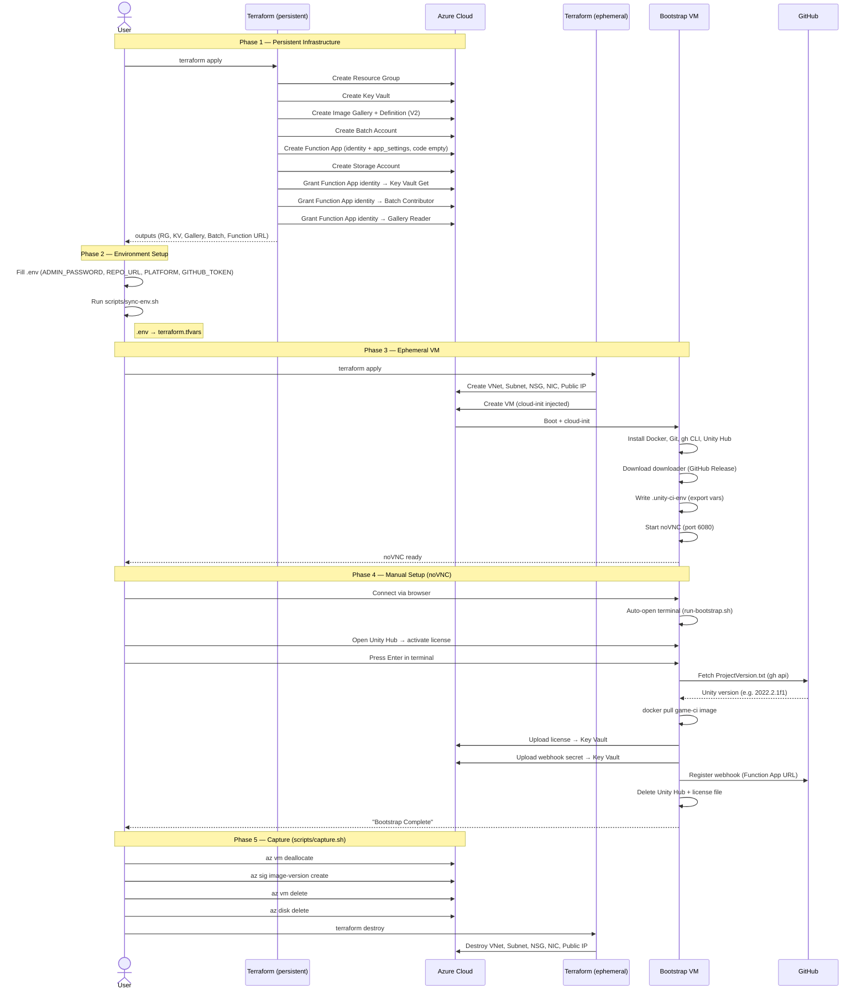
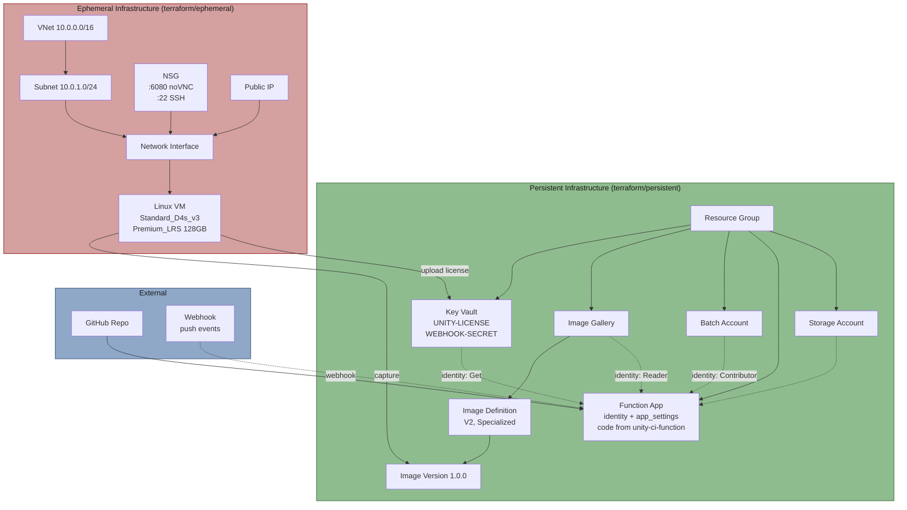
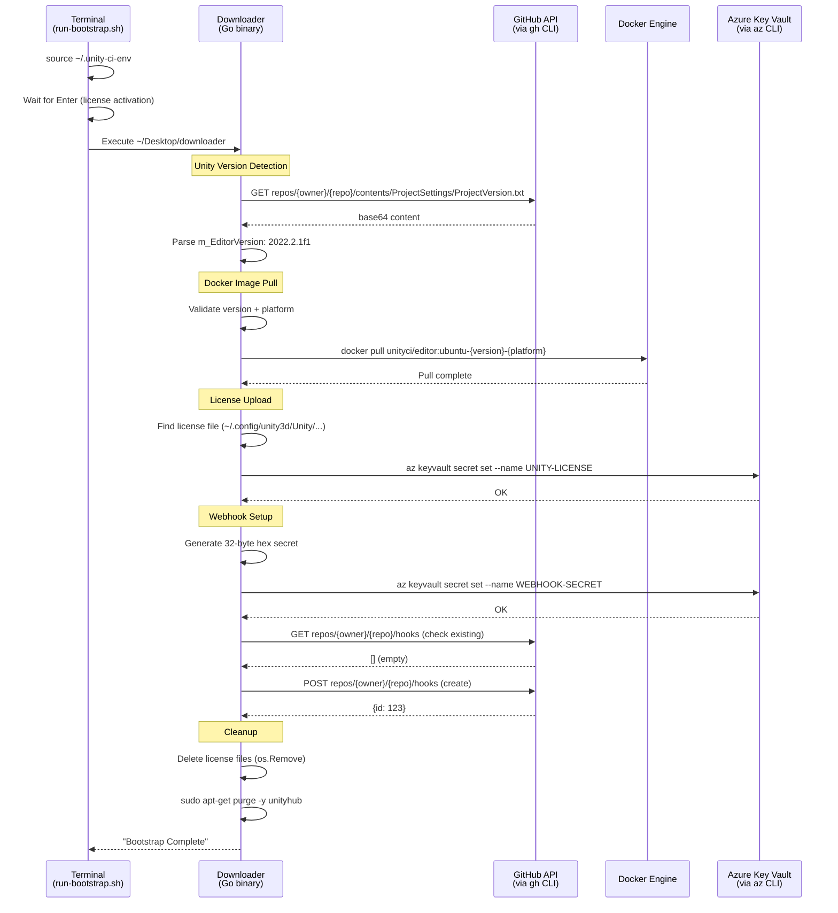
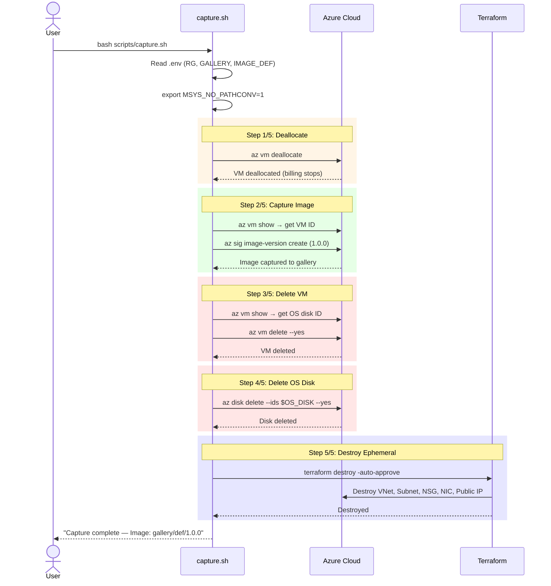
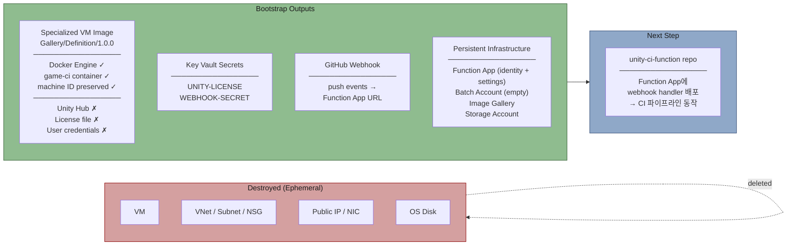

# Unity CI Bootstrap — Diagrams

## 0. Prerequisites

### Local Machine (User)

| Requirement | Purpose | Setup |
|-------------|---------|-------|
| **Azure CLI** (`az`) | Azure 리소스 관리, VM 제어 | `winget install Microsoft.AzureCLI` |
| **Terraform** | Infrastructure as Code | `winget install Hashicorp.Terraform` |
| **Go** (1.21+) | Downloader 빌드 (optional — Release에서 다운로드 가능) | `winget install GoLang.Go` |
| **Git Bash** or **WSL** | Bash 스크립트 실행 (capture.sh, sync-env.sh, build.sh) | Git for Windows 포함 |
| **GitHub CLI** (`gh`) | Release 생성 (optional — 개발자용) | `winget install GitHub.cli` |

### Accounts & Credentials

| Requirement | Purpose | 생성 방법 |
|-------------|---------|----------|
| **Azure Subscription** | 모든 클라우드 리소스 호스팅 | [portal.azure.com](https://portal.azure.com) |
| **Azure Login** (`az login`) | Terraform + az CLI 인증 | `az login` (브라우저 OAuth) |
| **GitHub PAT** (`GH_TOKEN`) | Webhook 등록 + Unity 버전 감지 | GitHub → Settings → Developer settings → Fine-grained tokens |
| **Unity Account** | Unity Hub 라이선스 활성화 | [id.unity.com](https://id.unity.com) |

### GitHub PAT 권한 (Fine-grained)

| Permission | Access | Purpose |
|------------|--------|---------|
| **Contents** | Read | `ProjectVersion.txt` 읽기 (Unity 버전 감지) |
| **Webhooks** | Read and Write | Webhook 등록/조회 |

> **Scope:** 대상 Unity 프로젝트 repo에만 접근 권한 부여 (all repositories 아님)

### Unity Project (대상 repo)

| Requirement | Description |
|-------------|-------------|
| `ProjectSettings/ProjectVersion.txt` | Unity 버전 자동 감지에 필요 (`m_EditorVersion: 2022.2.1f1` 형식) |
| game-ci 지원 버전 | [game.ci/docs/docker](https://game.ci/docs/docker) 에서 지원 버전 확인 |

---

## 1. Bootstrap Sequence (Full Workflow)

## 2. Infrastructure Component Diagram

## 3. Downloader Pipeline (VM 내부)

## 4. capture.sh Flow

## 5. Bootstrap 완료 후 결과물

### 재실행 조건

| Trigger | Action |
|---------|--------|
| Unity 버전 변경 | Phase 3~5 재실행 (새 game-ci image pull → 새 image capture) |
| 플랫폼 변경 (e.g. WebGL → Android) | Phase 3~5 재실행 (다른 game-ci image) |
